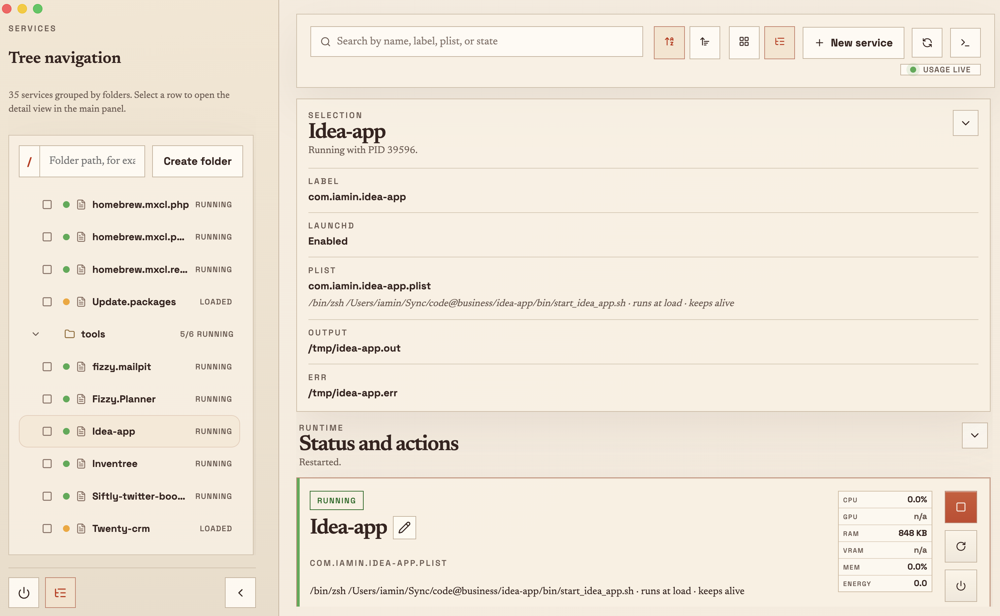
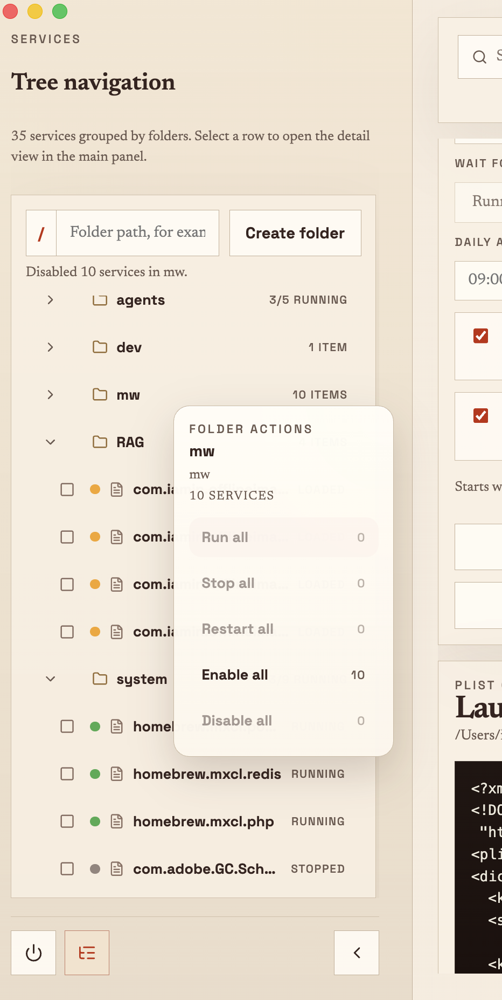
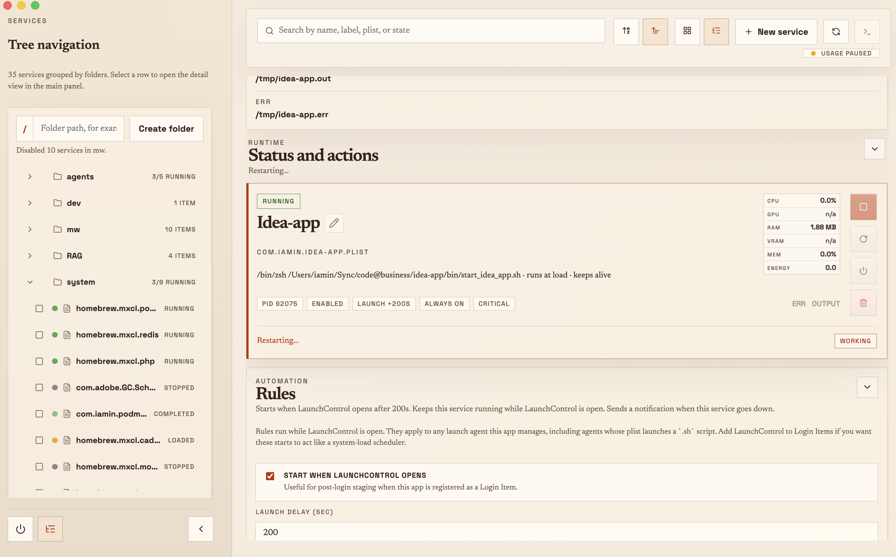
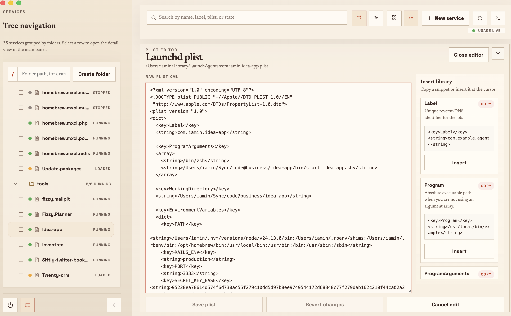
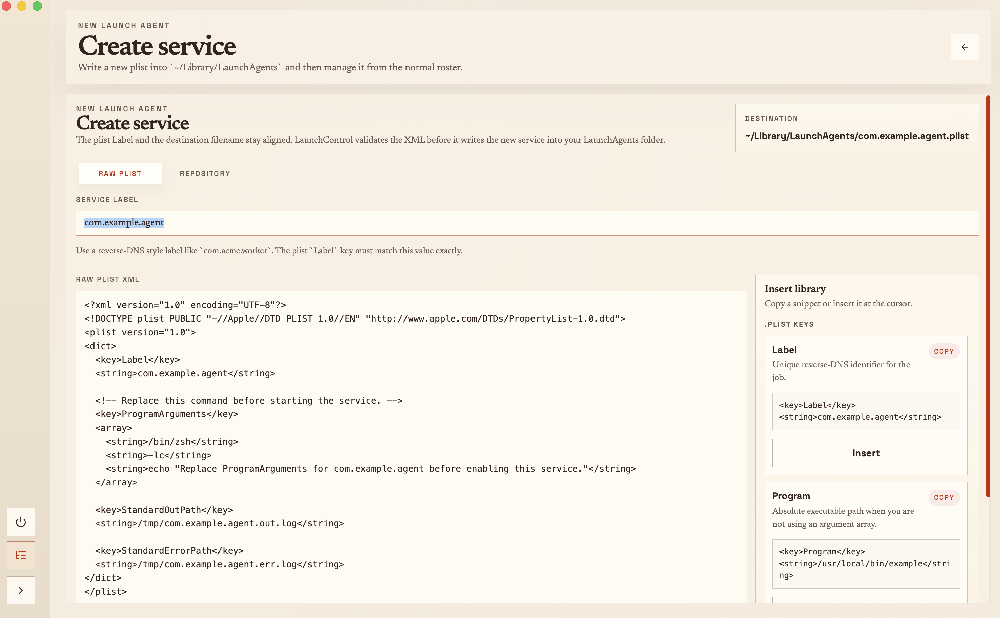

<div align="center">
  

  <h1>LaunchControl</h1>

  <p><strong>A native macOS control surface for user launchd services.</strong></p>
  <p>
    Browse, create, monitor, automate, and debug LaunchAgents without memorizing
    <code>launchctl</code> commands or hand-editing plist XML from scratch.
  </p>

  <p>
    
    
    
    
  </p>
</div>

<p align="center">
  
</p>

## Why LaunchControl

`launchd` is excellent at running background jobs, but the day-to-day interface
is usually a mix of `launchctl`, plist files, log tails, and guesswork.
LaunchControl keeps the power and makes the state visible: what is loaded, what
is running, what failed, what is scheduled, and what will happen next.

The app focuses on user-level macOS services in `~/Library/LaunchAgents` and
uses the current GUI launchd domain, `gui/<uid>`, for service actions.

## Highlights

| Area | What you get |
| --- | --- |
| Service tree | Browse services in grid or tree mode, organize them into folders, and keep names readable with aliases. |
| Direct controls | Start, stop, restart, enable, disable, and delete managed services from one window. |
| Plist workflow | Create new LaunchAgents, edit raw plist XML, insert common launchd snippets, and validate before saving. |
| Repository setup | Pick a project folder and let LaunchControl suggest run commands from package scripts, Procfiles, Makefiles, Cargo, and Go projects. |
| Automation | Start services when LaunchControl opens, run them at specific times, wait for dependencies, keep services running, and mark critical services for notifications. |
| Runtime stats | Track PID, state, CPU, memory, memory percent, energy impact, thread count, and CPU time for running jobs. |
| Logs and shells | Tail declared stdout/stderr logs, inspect plist or runner source, use an embedded xterm session, or open a Ghostty session. |

## Screenshots

<table>
  <tr>
    <td width="50%">
      
      <br>
      <sub>Tree navigation for grouped services.</sub>
    </td>
    <td width="50%">
      
      <br>
      <sub>Automation rules for startup, schedules, dependencies, and critical alerts.</sub>
    </td>
  </tr>
  <tr>
    <td width="50%">
      
      <br>
      <sub>Raw plist editing with launchd snippets and validation.</sub>
    </td>
    <td width="50%">
      
      <br>
      <sub>Create services from XML or from a detected repository command.</sub>
    </td>
  </tr>
</table>

## Quick Start

LaunchControl is an Electron app for macOS.

```bash
npm install
npm run dev
```

The dev command prepares the bundled Ghostty resource and starts
`electron-vite`.

## Common Commands

| Command | Purpose |
| --- | --- |
| `npm run dev` | Prepare Ghostty resources and run the app in development mode. |
| `npm run typecheck` | Type-check the Electron main/preload code and the renderer code. |
| `npm run build` | Build the Electron app with `electron-vite`. |
| `npm run dist` | Build and package macOS artifacts with `electron-builder`. |
| `npm run test:automation-coordinator` | Exercise automation scheduling, dependencies, keep-alive, and critical-service behavior. |
| `npm run test:live-runtime` | Exercise live runtime merge/display behavior. |
| `npm run test:log-tail-flow` | Exercise log-tail terminal behavior. |
| `npm run test:repository-template` | Exercise repository command template generation. |

## How It Works

```text
src/main/index.ts          Electron app lifecycle, tray, windows, IPC, notifications
src/main/launchd.ts        launchctl, plutil, service discovery, actions, logs, stats
src/main/automation.ts     Scheduled starts, dependency starts, ensure-running checks
src/main/store.ts          Local aliases, folders, automation settings, preferences
src/main/terminal.ts       Embedded node-pty terminal sessions
src/main/ghostty.ts        Ghostty app discovery and packaged runtime extraction
src/preload/index.ts       Safe renderer API exposed through contextBridge
src/renderer/src/App.tsx   React control surface
src/shared/types.ts        Main/preload/renderer contract types
```

LaunchControl reads user LaunchAgent plists from `~/Library/LaunchAgents`.
UI-only metadata such as aliases, folders, automation rules, and login-item
preference initialization is stored in Electron's `app.getPath('userData')`
directory as JSON.

## Safety Notes

- Service actions are local to the current macOS user session.
- Creating a service writes a plist into `~/Library/LaunchAgents`.
- Saving a plist validates it with `plutil` before keeping the new content.
- Deleting a managed service removes its plist file.
- Critical-service notifications fire only after LaunchControl has observed the
  service running and later sees it stop unexpectedly.

## Build Artifacts

Packaged output is written to `release/`.

```bash
npm run typecheck
npm run build
npm run dist
```

`electron-builder` uses `assets/icon.icns` for macOS packaging and includes the
bundled `vendor/Ghostty.zip` as an extra resource.

## Documentation

- [Product site](docs/index.html)
- [Changelog](CHANGELOG.md)
- [Screenshots](docs/screenshots)
